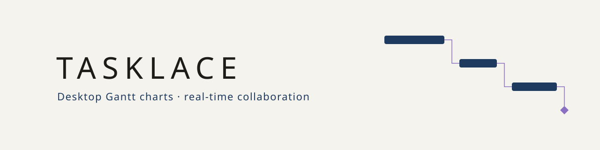

# Tasklace

<picture>
  <source media="(prefers-color-scheme: dark)" srcset=".github/assets/banner-dark.svg">
  
</picture>

[](https://github.com/GFayrr/tasklace/actions/workflows/ci.yml)
[](LICENSE)
[](#roadmap)
[](https://nodejs.org/)

A simple desktop application to create, edit, share and export Gantt charts, faithful to the rules of the Gantt method.

> [!IMPORTANT]
> Tasklace is in early development. The scheduling core, project validation, the `.tasklace` file format and JSON exchange are built and tested, but there is no user interface or downloadable release yet.

Tasklace is designed for students and professionals who want clear project plans without a steep learning curve. Every action should be obvious to a non-technical user: advanced features exist, but none is imposed.

## Table of Contents

- [Background](#background)
- [Features](#features)
- [Roadmap](#roadmap)
- [Install](#install)
- [Usage](#usage)
- [Project structure](#project-structure)
- [Maintainers](#maintainers)
- [Contributing](#contributing)
- [License](#license)

## Background

Most Gantt tools are either heavyweight project-management suites or online services that keep your data on their servers. Tasklace aims for the middle ground:

- **Strict Gantt rules**: tasks, milestones, summary tasks, the four dependency types, working calendars, progress and critical path.
- **Hour-level precision**: durations are expressed in hours and spread over working days, with optional hours per day.
- **Collaboration without an account**: people join a project with a sharing code, on the local network, or through an optional end-to-end encrypted relay that any school or company can host.
- **Offline first**: every member keeps a local copy and changes are merged when they reconnect.
- **Lightweight exports**: vector PDF files with selectable text.

## Features

What the core already supports:

- Automatic scheduling from the project start date, task start dates, durations and dependencies.
- Finish-to-start, start-to-start, finish-to-finish and start-to-finish dependencies, with lags and leads in working hours; dependency cycles are rejected.
- Working calendars: working weekdays, one or more daily time ranges and non-working periods; no public holiday is assumed.
- Durations in hours, with hours per day and an optional daily start hour per task.
- Split tasks: one task made of several blocks separated by interruptions.
- Milestones, nested summary tasks with duration-weighted progress, and WBS numbering (1, 1.1, 1.2…).
- Optional advanced features, disabled by default: critical path with total and free float, "must finish on" dates and deadlines, with conflicts reported rather than enforced.
- Optional tags that color the blocks: a 12-color default palette, any custom color, and automatic patterns when two colors could be confused, including for color-blind readers and grayscale prints.
- Tags representing a person or a team: overlapping work is detected hour by hour and reported as grouped conflict periods, without moving anything.
- Results that never depend on the order of the data, a prerequisite for real-time collaboration.
- Complete validation of untrusted project data before anything is loaded, with each problem reported at its exact location.
- `.tasklace` project files: compressed, checksummed and fully checked before opening, so that a damaged or forged file is refused without ever being loaded.
- JSON import and export: compact, versioned documents with dates in clear text.
- A shared project model where concurrent edits always merge into the same valid project for everyone, and a frozen baseline plan.

## Roadmap

- [x] Working-time calendar
- [x] Scheduling engine: dependencies, summaries, split tasks, critical path
- [x] Tags and person or team conflict detection
- [ ] Project file format, validation, JSON and CSV import and export (in progress: validation, JSON, the shared model and the `.tasklace` file are done)
- [ ] Desktop application and user interface
- [ ] PDF export
- [ ] Real-time collaboration on the local network
- [ ] End-to-end encrypted relay and deployment guide
- [ ] Portable Windows executable

Windows comes first; the code stays cross-platform so that macOS and Linux versions can follow. The [detailed roadmap](docs/roadmap.md) describes each step.

## Install

There is no release yet. When it is available, Tasklace will ship as a portable Windows executable: download it and double-click to run, with nothing else to install.

To work on the source code, you need [Node.js](https://nodejs.org/) 24 LTS and npm.

```sh
git clone https://github.com/GFayrr/tasklace.git
cd tasklace
npm install
```

## Usage

The following commands are for development only.

| Command                | Purpose                                                 |
| ---------------------- | ------------------------------------------------------- |
| `npm test`             | Run unit and property-based tests with coverage         |
| `npm run test:watch`   | Run tests in watch mode                                 |
| `npm run bench`        | Check performance on 10,000 tasks and 20,000 links      |
| `npm run bench:growth` | Check that key operations grow as their complexity says |
| `npm run lint`         | Type-check with TypeScript and lint with ESLint         |
| `npm run format`       | Format the code with Prettier                           |
| `npm run format:check` | Check formatting without changing files                 |

The test suite covers edge cases extensively and uses property-based testing to check scheduling invariants and data exchange on thousands of random projects, and to make sure that no malformed input is ever accepted. Continuous integration runs formatting, linting and tests on Windows and Linux for every push and pull request.

## Project structure

```
src/core/            pure logic, independent of any user interface
  baseline/          baseline plan snapshots
  calendar/          working-time calendar and task time slots
  exchange/          JSON import and export
  file/              .tasklace project file: header, checksum and defensive reading
  model/             project data types
  scheduling/        dependency graph, forward and backward passes, summaries, WBS
  shared/            shared Yjs document, merge repairs and fractional ordering
  tags/              tag colors, patterns and person or team conflicts
  testing/           test helpers and random data generators
  validation/        validation of untrusted project data
docs/                roadmap and user documentation
tests/file/          .tasklace files with real compression, decompression bombs
tests/fixtures/      large test projects generated from fixed seeds
tests/growth/        growth checks of key operations, run in CI
tests/perf/          performance benchmark
tests/repository/    repository hygiene checks
```

## Maintainers

[@GFayrr](https://github.com/GFayrr)

## Contributing

The project is at an early stage and is not accepting pull requests yet. Bug reports and suggestions are welcome in the [issue tracker](https://github.com/GFayrr/tasklace/issues).

## License

[AGPL-3.0-or-later](LICENSE) © Fayr
